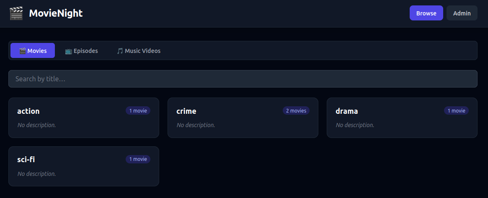
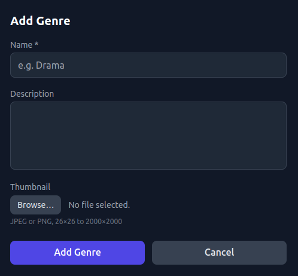
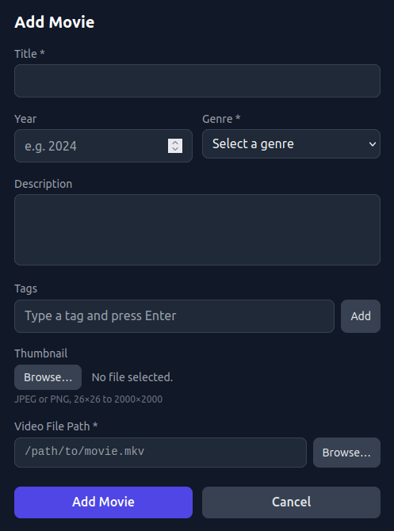
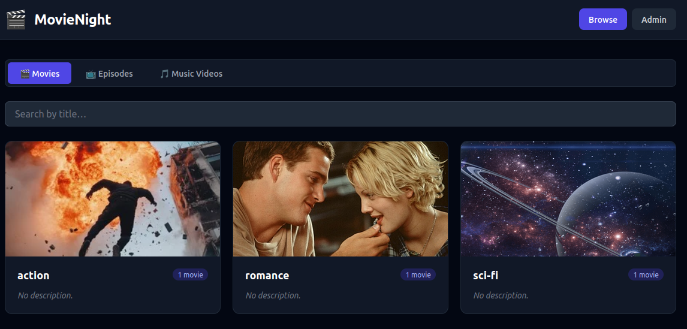
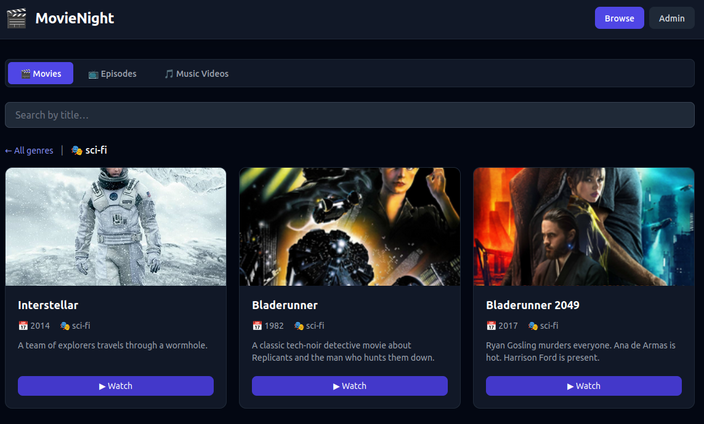
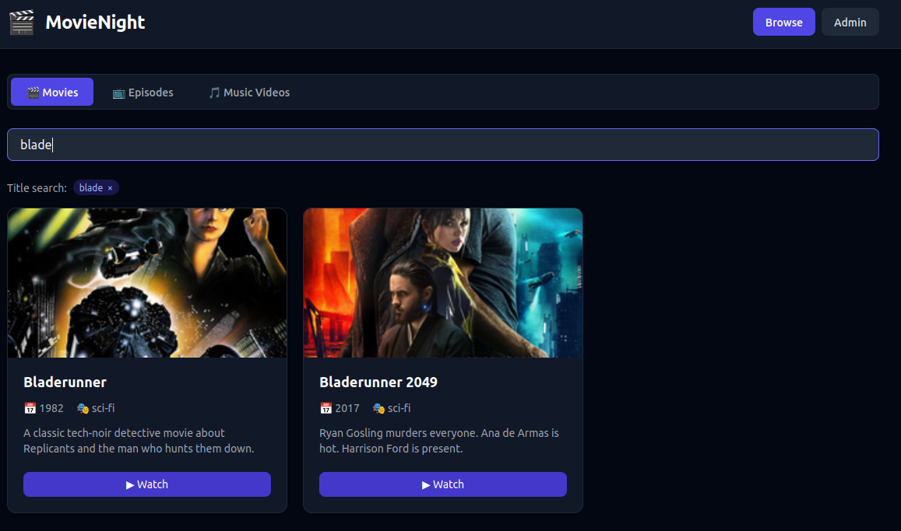

<p align="center">

</p>

# It's time for Movie Night!

MovieNight is a media-organizing and streaming application designed to work on a local network.
If you have a large local collection of movies, TV shows, and/or music videos, MovieNight
provides a simple and friendly interface to browse your collection and stream media to your devices.
The basic read-only interface is available without authentication. An Admin interface is also
available, with basic authentication and optional localhost-only access restriction. Use the Admin
interface to add, edit, and delete media items in your collection, and then use the read-only
interface to browse and stream your media!

## Getting started

MovieNight is still in early development, so there is no installer package available yet.
To get started, clone the repository and build with Maven (Java 17+ required):

```bash
git clone https://github.com/scorbo2/MovieNight.git

# We build from the "backend" directory, but this builds the whole thing:
cd MovieNight/backend
mvn clean package
```

This generates a standalone executable Jar file in the `target` directory.
You can run it with default settings using:

```bash
# Note: version number may vary from this example:
java -jar target/MovieNight-1.0.jar
```

By default, this will listen on port 8080 and will use `/var/lib/movienight` for storing media metadata.
(Make sure that directory exists and is writable by the application before running).
The access credentials for the Admin API will be `admin`/`change-me` - but these are not great defaults!

### Running with custom settings

Create an `application-prod.properties` file in the same directory as the executable Jar file, and then
you can customize the settings:

```properties
server.port=8080
#
# This defaults to the system temp dir if unspecified:
logging.file.name=/path/to/movienight.log
#
# If false, Admin access is allowed from anywhere:
movienight.admin.localhost-only=false
#
# Number of days to consider a media item as "recently watched"
# (set this to 0 to disable the "recently watched" feature)
movienight.recently-watched-days=3
#
# This db file will be created and managed automatically.
# But the directory where it lives has to be writable by us.
spring.datasource.url=jdbc:sqlite:/path/to/movienight.db
#
# All uploaded thumbnails will go to this data dir:
movienight.data-dir=/path/to/movienight-data-dir
#
# Don't leave this as admin/change-me!
movienight.admin.username=admin
movienight.admin.password=change-me
```

Alternatively, many of the above settings can be controlled with environment variables:

```bash
export MOVIENIGHT_LOG_FILE=/path/to/movienight.log
export MOVIENIGHT_DB_PATH=/path/to/movienight.db
export MOVIENIGHT_DATA_DIR=/path/to/movienight-data-dir
export MOVIENIGHT_ADMIN_USERNAME=admin
export MOVIENIGHT_ADMIN_PASSWORD=change-me
```

## First-time startup

MovieNight comes with a few built-in categories to get you started. It looks like this:



These categories are very basic, and don't have thumbnails, so the initial experience is pretty bland!
Fortunately, this is very easy to fix. Hit the "Admin" button in the upper right corner to switch
to Admin mode. Here, we can edit the predefined categories, or delete them entirely and create our own.
You can upload thumbnails for each category. The edit form looks like this:



Each media type has its own categorization type:

- Movies are categorized by genre (Action, Comedy, etc.)
- TV shows are categorized by series (The Office, Breaking Bad, etc.)
- Music videos are categorized by artist (Duran Duran, The Beatles, etc.)

The edit form for each category allows you to set the name, optional description, and optional
thumbnail image for that type. The screenshot above shows the edit form for a Movie genre,
but the other edit forms are very similar.

## Adding media items

Once you've added your categories (genres, series, and artists), you are ready to start adding media items!
Note that there is no "upload" feature in MovieNight. The assumption is that MovieNight will be run
on a local server that also contains (or has access to) your media files. So, the edit form for each
media type includes a file browser that will allow you to navigate whatever filesystem the server has access to.
You select the media file, and MovieNight will record its location on the filesystem. Later, it will be streamed
from that location. The only thing MovieNight needs to store is the metadata (title, description, thumbnail)
for the media, and the file path to the media file itself. Here's a look at the edit form for a Movie media item:



The only mandatory fields here are `title`, `genre`, and `video file path`. The `genre` field is a dropdown
that will show all the genres you've created in the Admin interface. The `video file path` can either be
entered manually, or via the file browser. Remember that the file browser is showing you the server's filesystem,
not the filesystem on whatever system you are accessing the Admin interface from!

Note that as soon as you hit the save button, you will be prompted by your browser for the Admin API credentials.
The Admin API defaults to using basic authentication (username/password). You can change the username and password
in the settings, as described in the "Running with custom settings" section above.

## Browsing and searching

So you've added your media items, and you've built up quite a large list! In order to help you navigate your collection,
MovieNight will start by showing you the categories for the media type in question. For example, let's click
on the "Movies" category on the homepage. This will show us all the genres we've created:



This looks much better! We see a card with each genre that we've defined, along with a count of how many
movies are in that genre. Clicking on a genre will take you to a filtered list of movies in that genre:



Each media item also has the concept of "tags". These are arbitrary free-form strings that you can enter
as additional searchable metadata for the media item. For example, you could tag a movie with "Christmas"
if it's a Christmas movie, or you can enter actor/actress names as tags. This makes it much easier to
search through your library as your collection grows! Use the search bar at the top of the list
to search by title or tag. For example, let's search for "blade":



We see the two "Bladerunner" films are shown. Our search term is also shown at the top, next to an "x"
control that allows you to cancel the search and return to the category view.

## Streaming media

Each media item card has a "Watch" button which will bring up an inline media player for that item.
Use the media player controls to play, pause, or seek through the media. You can go full screen for
a better viewing experience! Click the "Hide" button while streaming to hide the media player and stop the stream.

## More information

Project page: https://github.com/scorbo2/MovieNight

Issues page: https://github.com/scorbo2/MovieNight/issues

MovieNight is distributed under the [MIT License](LICENSE).
