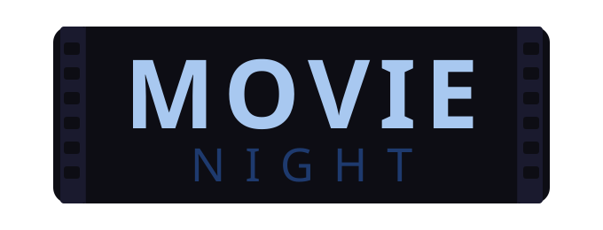
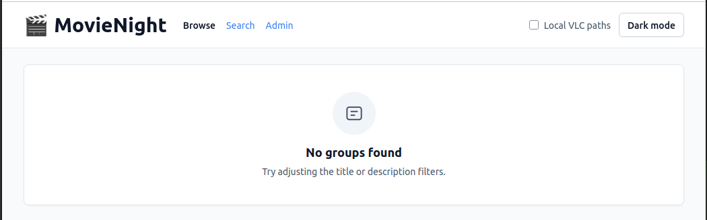
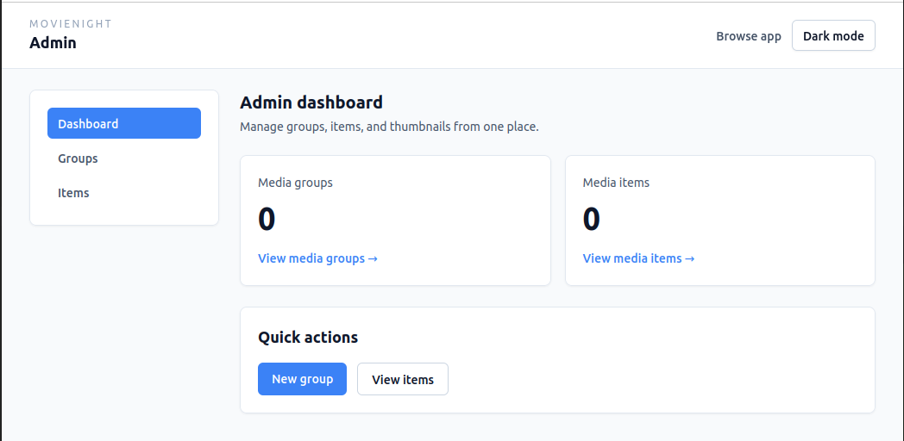
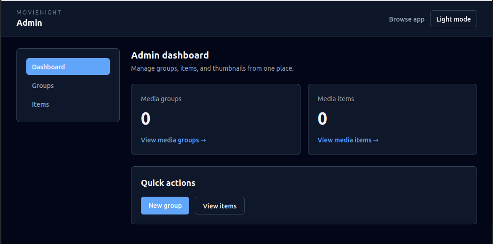
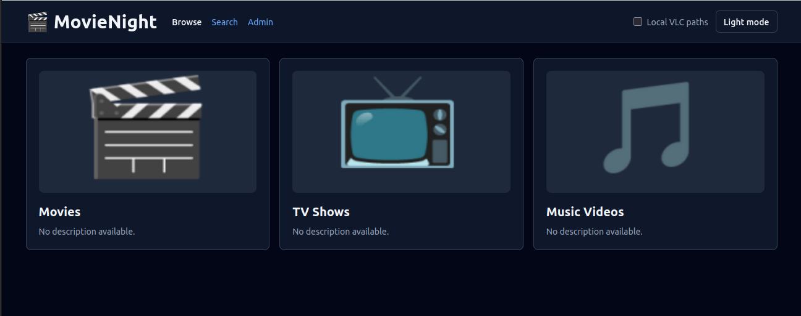
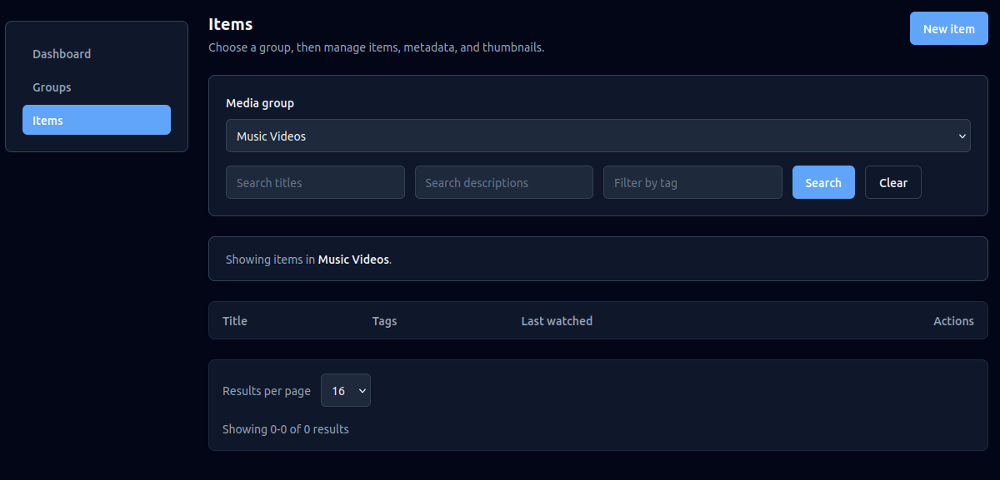
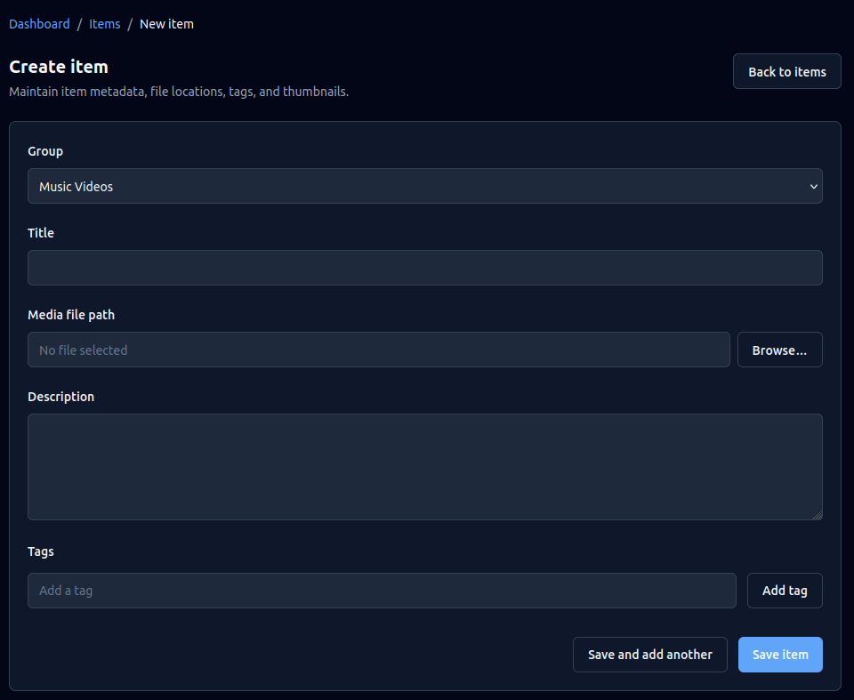
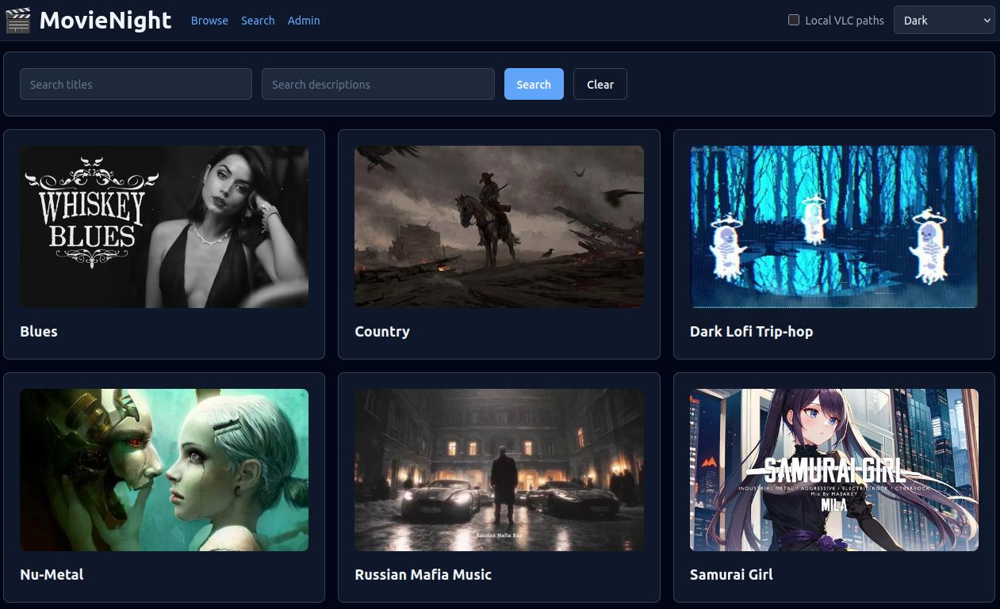
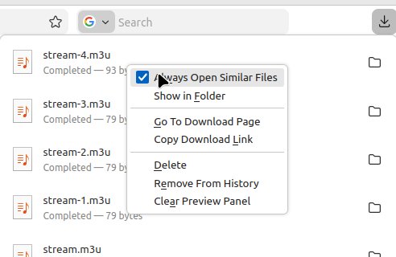
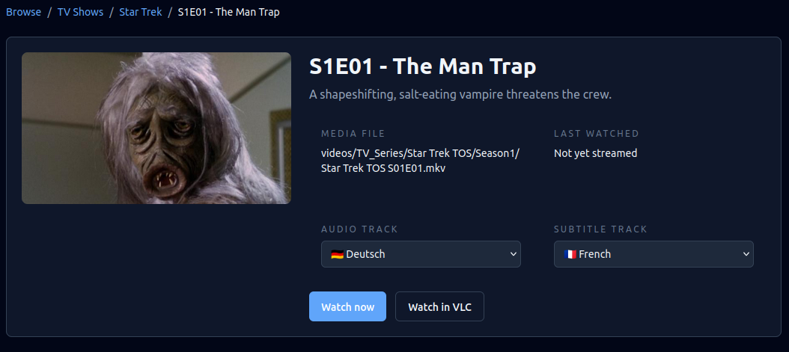

<p align="center">

</p>

# It's time for Movie Night!

MovieNight is a media-organizing and streaming application designed to work on a local network.
If you have a large local collection of movies, TV shows, and/or music videos, MovieNight
provides a simple and friendly interface to browse your collection and stream media to your devices.
Videos can either be watched inline in the browser, or launched in VLC, if VLC is installed and your
browser is properly configured.

An Admin UI is provided to add, edit, or delete media items in your collection. Then you can use
the Browse/Search UI to explore your collection and stream media!

## Getting started

MovieNight has been tested on Linux. To get started, clone the repository and build it.
You'll need Java 25 and a recent version of Maven to build the back end code.
You will also need npm installed to build the front end code (but you don't have to do that manually).

```bash
git clone https://github.com/scorbo2/MovieNight.git

# We build from the "backend" directory, but this builds the whole thing:
cd MovieNight/backend
mvn clean package
```

This generates a fully standalone executable Jar file in the `backend/target` directory.
The jar contains the built front-end as well, so you can launch the whole thing all together!
However, the jar file is generated in the `MovieNight/backend/target` directory, and it's generally
not a good idea to run from there. The application stores configuration and thumbnails in the same
directory as the jar by default. The next time you do a clean build, you may lose this data.
So, let's move the jar file somewhere dedicated (in this example, we'll house it on the same machine
where we built it, but you could scp it to a different machine on your network):

```shell
mkdir ~/MovieNight
mv target/MovieNight-2.0-SNAPSHOT.jar ~/MovieNight/
cd ~/MovieNight

# Now we can start it up!
java -jar MovieNight-2.0-SNAPSHOT.jar
```

If this is your first time running the application, it will enter "interactive config mode" and ask
you questions to create the initial config. You'll be given the option of saving this config to a config
file on disk, which you can later edit to change settings. If the config file is stored together with
the jar file (or in a "config" subdirectory), the application will pick it up automatically on next run.
If you prefer to keep the config file elsewhere, you can specify its location with the `MOVIENIGHT_CONFIG_FILE`
environment variable (see "Configuration" section later for more details). By default, interactive mode
will save the config file to the current working directory.

The application will start up on port `8080` by default (unless you picked a different port above), and will
be accessible at `http://<your-server-ip>:8080` from any device on the same local network. The Browse UI and
the Admin UI are both served in the same single-page application at that address. Let's fire up a browser and
check it out!

## First time run

When the UI first comes up, it will look pretty empty!



Click the `Admin` link at the top of the page to access the Admin dashboard:



At any point, you can optionally click the "dark mode" toggle in the very top right to stop burning your eyes:



### Setting up media groups

Click the "New Group" quick action to add your first media group. Media groups are containers that can
contain media items or other media groups. This can be a great way to organize your collection,
especially if you have a large and varied collection of media. Here's one suggested way to get
started with groups:

- Movies
- TV Shows
- Music Videos

When creating your first groups, select "None (top-level)" for the "Parent group". This creates a "top-level" group.
These top-level groups will be displayed on the main browse page. You can also add a thumbnail image for each group,
which makes browse mode look a lot nicer. Once our initial groups are set up, click "Browse app" in the top right
to return to browse mode:



Okay, looking a bit better now! But we don't have any media items yet. 

### Setting up media items

Go back to Admin mode and click "Items" from the left menu in the dashboard. This brings up the items page:



Once you select a parent group from the "Media Group" dropdown, the "New Item" button will become enabled.
Note that you need at least one top-level group to add items! Media items can't be added to the top-level.
Let's add a new item to the "Music Videos" group:



The only mandatory fields are Group, Title, and Media file path. There's an optional Description field,
and also an optional "Tags" field. Tags are keywords that you can associate with media items, and are useful
for searching across media groups. For example, you could add tags for your favorite actors or directors, and
easily find all media items that match those tags, regardless of which group(s) they are in. See the section
on Search Mode later on.

Clicking the Browse button next to the Media file path field will open a file browser. But note that this
file browser is showing you the *server's* file system, not your local file system. The browser will be locked
to whatever directory you configured to be the server's media directory.

Click "Save item" to save the new item and return to the items list, or click "Save and add another" to
save the new item and immediately start adding another one.

#### Thumbnails

If a media file has a companion thumbnail image in the same directory with the same filename, it will be picked
up automatically. For example:

```shell
Bladerunner.mkv
Bladerunner.jpg
```

Both JPEG and PNG image formats are supported. Alternatively, you can use the "Thumbnail" tab on the "Edit item"
screen to pick any image file on your local machine to upload as the thumbnail for that media item. Each media
item can have only zero or one thumbnail image associated with it.

MovieNight comes with a pair of helper scripts that can be used to generate thumbnail images for all media files
in a given directory. You must have `ffmpeg` installed and access to a bash shell to use these scripts.
Refer to the [README.md](tools/README.md) in the `tools` subdirectory for more information on how to do this.

Note that if you use the Thumbnails tab to upload a thumbnail for a media item, it will be stored alongside
the media file itself, as with the Bladerunner example above. Media Groups can also have thumbnails, but those
images are stored in the server's configured thumbnails directory instead (since they don't belong to any
particular file or directory on disk).

Once we've added some media items, the browse page starts to look a lot more fun!



### Search Mode

Click the "Search" link at the very top to access Search mode. An alphabetized list of all media items in your
collection is shown in the grid. Above the grid are filter fields that allow you to filter the list
by title, by description, or by tags. This is a great way to quickly find what you're looking for!

## Playback

There are two main options for media playback:

- directly in the browser (using the HTML5 video player)
- in VLC (if VLC is installed and your browser is configured to launch VLC for M3U playlists)

### Inline playback

This is the quickest and easiest option, and will work with almost any modern web browser.
On any media item details page, just click the "Watch now" button to open an inline video player.
You can hit play to begin playback, and optionally hit the fullscreen button to expand to full screen.
Hit ESC to exit fullscreen mode and return to the browser tab.

### VLC integration

If your video files have multiple language tracks, or if you just generally prefer VLC's interface for playback,
If your video files have multiple language tracks, or if you just generally prefer VLC's interface for playback,
then MovieNight has you covered! On any media item details page, click the "Watch in VLC" button to generate and download
an M3U playlist file that will stream that file from the server. Depending on your browser, you may have to do
right-click the item in your Downloads list and select "Always open similar files", as shown here:



After that point, VLC should launch automatically and begin playing the media item. **This is necessary if you
want to access additional language tracks and/or subtitle tracks!** Unfortunately, the inline HTML5 video player
does not support multiple language tracks, so you will only be able to hear the default language track.
But VLC supports it! MovieNight can detect if a media file has multiple language and/or subtitle tracks,
and it will present additional dropdown choosers on the media item details page, like this:



We see that we have selected the German audio track and the French subtitle track, for language learning
on extra-hard mode. These options only apply to the "Watch in VLC" action! When we launch VLC with these
options selected, the video will start playing in VLC with the selected audio and subtitle tracks already selected.

Note that when browsing Media Groups, you will notice a "Watch all in VLC" action button at the top of the
group display page. This does exactly what it sounds like - it will generate and download an M3U playlist
containing all media items that are direct children of that media group. This is great for binge-watching! :)

## Configuration

Let's take a closer look at "interactive mode" on a first-time launch. The application will prompt you
for a few basic configuration items, and then create a skeletal configuration file for you, that you
have the option to save. The process might look like this:

```bash
scorbett@sclaptop6:~/MovieNight/backend$ java -jar target/MovieNight-2.0-SNAPSHOT.jar 
No configuration file found!

What port shall we listen on? [8080]: 9999
Where are our media files? [/home/scorbett/MovieNight/.]: 
Where are our thumbnails? [/home/scorbett/MovieNight/thumbnails]:
Where is our database file? [/home/scorbett/MovieNight/MovieNight.db]: 
Database file does not exist. Will be created.
Enable file-based logging? [y/N]: y
Where should we write logs? [/home/scorbett/MovieNight/MovieNight.log]: 
Would you like to save this config? [Y/n]: n
Config not saved. You will need to re-enter these values next time.
File logging enabled: /home/scorbett/MovieNight/MovieNight.log
...
```

All configuration questions have a default value, so you could just hit `Enter` at each prompt to accept the
defaults. In the example above, note that we picked port `9999` instead of the default `8080`. At a minimum,
you'll likely want to change the media directory from the default (which is the current working directory wherever
you launched the application from). You can also enable file-based logging, if you wish.

The application then echoes out the active configuration and starts up on the requested port. We see the URL
where the web UI is available, and also the URL for the back-end API (you can typically ignore this, but it's
handy for debugging).

If you opt to save the generated config, you can hand-edit the generated config at any time and restart the
application to pick up the changes. Note that the config file offers you a few extra options that were
not presented in interactive mode. A full config file example is included, with descriptions of each property:
[example](backend/src/main/resources/application.properties)

## License

MovieNight is licensed under the MIT License. See [LICENSE](LICENSE) for more information.

## Links and more information

- [GitHub Repository](https://github.com/scorbo2/MovieNight) - browse the source code or contribute to the project!
- [Issues page](https://github.com/scorbo2/MovieNight/issues) - file an issue if you're having problems, or if you have
  a feature request!
